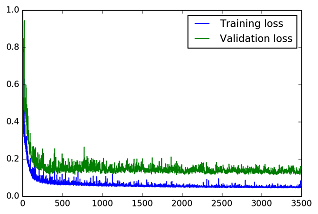
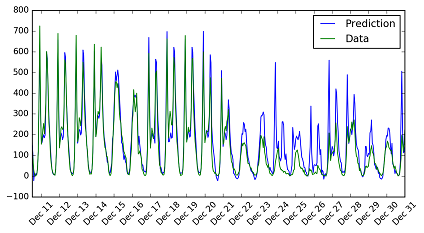

# Deep Learning Projects for [Udacity Deep Learning ND](https://classroom.udacity.com/nanodegrees/nd101/syllabus/core-curriculum)
Built Tensorflow based [Image Generator](#GAN) (GAN), [Language Translator](#LT) (Sequence-to-Sequence), [TV Script Generator](#TVSG) (RNN), [Image Classifier](#IC) (CNN), and a [Neural Network](#NN).

<sub>*Udacity Deep Learning is an ongoing course. For academic integrity, the source code of my implementation are private. If you like to view the code, please let me know.*</sub>

<a id='GAN'></a>
### Image Generation

Build generative adversarial networks (GAN) to generate new images of digits and faces. In our GAN networks, we have a CNN (convolutional neural network) Discriminator and a tranpose CNN (CNNT) Generator. The project uses Tensorflow.  

##### Input date are:

| 60,000 MNIST Images      | 200,000 Celebration images  |
|:---------------------------------------------:|:---------------------------------------------:|
|   *28x28, < 1 KB* | *178x218, 2.8-19 KB* |
|  |  |

##### Network design 
 
| Discriminator layers | Generator layers |
|:-------------------- |:------------------|
| - CNN for input  |  - fully connected for input |
| - 2 hidden CNN  | - 2 hidden CNNT | 
| - fully connected for output | - CNNT for output |

##### The same network is used for generating black-white images and color images.

| 60,000 MNIST Images      | 200,000 Celebration images  |
|:------------------------:|:-----------------------------:|
| *training loss* | *training loss* |
|   |  |
| show 5  Row of Training Progress | Show 10 Row of Training Progress |
|   |  |

<a id='LT'></a>
### Language Translation

This project is an excise of neural network machine translation. Build a sequence to sequence model, then train the model on a dataset of English and French sentences that can translate new sentences from English to French.


A basic Sequence-to-Sequence model consists:
* model_inputs
* process_decoding_input
* encoding_layer
* decoding_layer_train
* decoding_layer_infer
* decoding_layer
* seq2seq_model
Use RNN (recurrent neural network) and LSTM (long short term memory). 

Translate sentence of "he saw a old yellow truck.":

``` Input
  Word Ids:      [12, 200, 130, 25, 205, 158, 102, 0, 0, 0, 0, 0, 0, 0, 0, 0, 0, 0, 0, 0, 0, 0, 0, 0]
  English Words: ['he', 'saw', 'a', 'old', 'yellow', 'truck', '.', '<PAD>', '<PAD>', '<PAD>', '<PAD>', '<PAD>', '<PAD>', '<PAD>', '<PAD>', '<PAD>', '<PAD>', '<PAD>', '<PAD>', '<PAD>', '<PAD>', '<PAD>', '<PAD>', '<PAD>']

Prediction
  Word Ids:      [137, 310, 303, 272, 69, 309, 201, 115, 1]
  French Words: ['il', 'a', 'vu', 'un', 'vieux', 'camion', 'jaune', '.', '<EOS>']
```

<a id='TVSG'></a>
### TV Script Generation

|      |       |
|:----:|:-----|
|  | Use RNNs to generate Simpsons TV scripts. The input data only contains scene in Moe's Tavern, total 59338 words. Use RNN, LSTM, word embedding. |

Generated script:

```
moe_szyslak:(sings) i've been a good like it, moe. if you say my best time you can be as like our most inspector-- homer tonight!
homer_simpson:(checking around) what's this-- what?
homer_simpson:(reaching) no? greystash!
snake_jailbird:(sings) all right, i've been seen at fifty anymore. and she fixed!
moe_szyslak:(quietly) sounds for the perfect bucks who is sitting here the end.
homer_simpson:(excited) yeah, sweet cocktail in those the day of the sunday are being funny?
marge_simpson: i put me in much as and sadder about my song friend.
apu_nahasapeemapetilon:(nervous chuckle)
listen never wants to go to be a pipe.
homer_simpson: well, what happened?
marge_simpson: what are?...
waylon_smithers: just so not my best for as.
homer_simpson:(loud sotto him) / can do those funny about anyone to you...
homer_simpson:(grim) you know, then we're into the grampa!
lenny_leonard:, i'm
```

<a id='IC'></a>
### Image Classification

<a id='NN'></a>
### Neural Network

Build a neural network without using a deepp learning framework and use it to predict daily bike rental ridership. 
Input is Bike Sharing Data, the following graph shows the hourly rent in 2011:


##### The network is built with numpy. 
* 1 hidden layer 
* sigmoid activation function

##### Training
For learning rate of 0.1 trained 3500 epochs, the following graph showed the training and validation loss:



##### Test
The following graph shows the prediction of model and the data:


